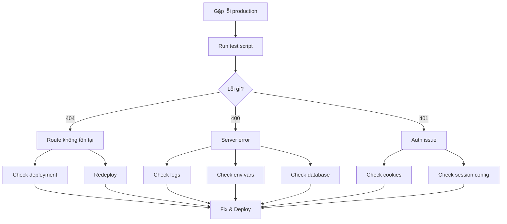

# 🔧 Làm Sao Để Debug API Errors

## 🎯 TL;DR - Làm ngay bây giờ

Bạn đang gặp lỗi 400/404 trên production? Làm theo 3 bước này:

### Bước 1: Chạy test script

```powershell
# Windows PowerShell
.\test-api-errors.ps1 -TestEmail "your-email@gmail.com" -TestPassword "YourPass123"
```

```bash
# Mac/Linux
npm run test:api:azure
```

### Bước 2: Xem logs

```bash
# Azure
az webapp log tail --name firbox-api --resource-group firbox-rg

# Hoặc mở Azure Portal > App Services > firbox-api > Log stream
```

### Bước 3: Fix based on errors

- **404 Not Found** → File không được deploy → Redeploy
- **400 Bad Request** → Server error → Check logs + env vars
- **401 Unauthorized** → Auth issue → Check cookies/session

---

## 📁 Files đã tạo cho bạn

### 1. Test Scripts

| File | Mục đích | Cách dùng |
|------|----------|-----------|
| `test-api-errors.ps1` | PowerShell script test API | `.\test-api-errors.ps1` |
| `scripts/test-api-detailed.ts` | Node.js script chi tiết | `npm run test:api` |

### 2. Documentation

| File | Nội dung |
|------|----------|
| `DEBUG_API_QUICK_START.md` | Hướng dẫn nhanh |
| `docs/DEBUG_PRODUCTION_ERRORS.md` | Hướng dẫn đầy đủ |
| `docs/DEBUG_400_ERROR.md` | Debug notes cũ |

---

## 🚀 Các lệnh quan trọng

### Test API

```bash
# Test Azure
npm run test:api:azure

# Test custom URL
TEST_API_URL="https://your-app.com" npm run test:api

# PowerShell
.\test-api-errors.ps1
```

### Xem Logs

```bash
# Azure - Live stream
az webapp log tail --name firbox-api --resource-group firbox-rg

# Azure - Download
az webapp log download --name firbox-api --resource-group firbox-rg --log-file logs.zip

# Vercel
vercel logs
```

### Check Environment Variables

```bash
# List all
az webapp config appsettings list --name firbox-api --resource-group firbox-rg

# Set variable
az webapp config appsettings set --name firbox-api --resource-group firbox-rg \
  --settings VAR_NAME="value"
```

### SSH vào Server

```bash
# Azure
az webapp ssh --name firbox-api --resource-group firbox-rg

# Sau đó trong container
cd /home/site/wwwroot
ls -la
npx prisma generate
```

---

## 🐛 Common Errors & Quick Fixes

### Error: `400 Bad Request` trên `/api/conversations/{id}/messages`

**Nguyên nhân phổ biến:**
1. Database connection failed
2. Prisma client not generated
3. Session/Cookie issue
4. Missing environment variables

**Fix:**

```bash
# 1. Check logs
az webapp log tail --name firbox-api --resource-group firbox-rg | grep ERROR

# 2. Regenerate Prisma
az webapp ssh --name firbox-api --resource-group firbox-rg
npx prisma generate
npx prisma migrate deploy

# 3. Verify env vars
az webapp config appsettings list --name firbox-api --resource-group firbox-rg | grep DATABASE_URL
```

### Error: `404 Not Found` trên `/api/chat/send`

**Nguyên nhân phổ biến:**
1. Route file not deployed
2. Build process skipped the file
3. Routing config issue

**Fix:**

```bash
# 1. Force redeploy
git commit --allow-empty -m "Redeploy"
git push

# 2. Check if file exists
az webapp ssh --name firbox-api --resource-group firbox-rg
ls -la .next/server/app/api/chat/

# 3. Verify build output includes the route
```

### Error: `401 Unauthorized`

**Nguyên nhân:**
- Cookies not sent
- Session expired
- Wrong auth config

**Fix:**

Check `src/lib/auth/session.ts`:
```typescript
export const sessionOptions = {
  cookieOptions: {
    secure: process.env.NODE_ENV === 'production', // Must be true in prod
    httpOnly: true,
    sameSite: 'lax',
  }
}
```

---

## 📊 Interpret Test Results

### ✅ Good Signs

```
✅ GET /api/health: 200
✅ CSRF Token: abc123...
✅ Signup successful
✅ Got 5 messages
```

### ⚠️ Warning Signs

```
⚠️  401 - Unauthorized (route exists, needs auth)
⚠️  User already exists, trying signin...
```

→ Cần xử lý nhưng không phải lỗi nghiêm trọng

### ❌ Critical Issues

```
❌ 404 - Route NOT FOUND
❌ Failed to get conversations
❌ 400 Bad Request
❌ Health check failed
```

→ Cần fix ngay

---

## 🔍 Debug Workflow



### Chi tiết từng bước:

1. **Run test script** → Xác định lỗi chính xác
2. **Check logs** → Tìm root cause
3. **Fix issue** → Apply solution
4. **Redeploy** → Deploy fix
5. **Verify** → Run test lại để confirm

---

## 💡 Pro Tips

### Tip 1: Always check logs first

```bash
# Keep this running in a separate terminal
az webapp log tail --name firbox-api --resource-group firbox-rg | grep -E "(ERROR|WARN|Failed)"
```

### Tip 2: Use test script with every deploy

```bash
# After each deploy
npm run test:api:azure

# Should see all green ✅
```

### Tip 3: Compare local vs production

```bash
# Test local
TEST_API_URL="http://localhost:3000" npm run test:api

# Test production
npm run test:api:azure

# Compare results
```

### Tip 4: Keep environment variables in sync

```bash
# Export from local .env
cat .env

# Compare with production
az webapp config appsettings list --name firbox-api --resource-group firbox-rg
```

### Tip 5: Monitor regularly

```bash
# Add to cron job or GitHub Actions
npm run test:smoke
npm run monitor:health
```

---

## 🆘 Still Stuck?

### Tạo report để xin trợ giúp:

```bash
# 1. Run tests
npm run test:api:azure > test-output.txt 2>&1

# 2. Get logs
az webapp log download --name firbox-api --resource-group firbox-rg --log-file logs.zip

# 3. List env vars (remove sensitive data)
az webapp config appsettings list --name firbox-api --resource-group firbox-rg > env-list.txt

# 4. Get deployment info
az webapp deployment list --name firbox-api --resource-group firbox-rg > deployments.txt
```

Gửi 4 files này kèm theo:
- Error message từ browser console
- Screenshot nếu có
- Mô tả chi tiết: "Hoạt động OK ở đâu, lỗi ở đâu"

---

## 📚 More Resources

- [Quick Start Guide](./DEBUG_API_QUICK_START.md) - Hướng dẫn nhanh
- [Full Debug Guide](./docs/DEBUG_PRODUCTION_ERRORS.md) - Hướng dẫn đầy đủ
- [Azure Deployment](./docs/AZURE_DEPLOYMENT.md) - Azure setup
- [Environment Variables](./docs/ENVIRONMENT_VARS.md) - Env vars reference
- [Observability Setup](./docs/OBSERVABILITY_SETUP.md) - Logging guide

---

## ✅ Checklist

In ra và check:

```
[ ] Ran test script
[ ] Checked logs
[ ] Verified all routes return correct status codes
[ ] All environment variables set
[ ] Database connection works
[ ] Prisma client generated
[ ] Session/Cookie works
[ ] Deployed successfully
[ ] Tested post-deploy
```

Khi tất cả đều ✅, production của bạn sẽ hoạt động OK! 🎉

